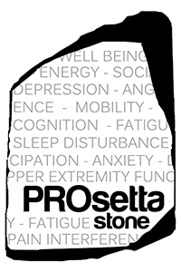

# PROsetta 

<!-- badges: start -->

[](https://github.com/choi-phd/PROsetta/actions)
[](https://cran.r-project.org/package=PROsetta)
<!-- badges: end -->

**PROsetta** package provides functions for metric-linking of item
parameters and producing crosswalk tables as used in the [PROsetta Stone
project](http://prosettastone.org/).

The primary aim of the PROsetta Stone project (1RC4CA157236-01, PI:
David Cella) is to develop and apply methods to link the
Patient-Reported Outcomes Measurement Information System (PROMIS)
measures with other related “legacy” instruments to expand the range of
PRO assessment options within a common, standardized metric. The project
identifies and applies appropriate linking methods that allow scores on
a range of PRO instruments to be expressed as standardized T-score
metrics linked to the PROMIS.

# Introduction

A common problem when using a variety of patient-reported outcome
measures (PROs) for diverse populations and subgroups is establishing
the comparability of scales or units on which the outcomes are reported.
The lack of comparability in metrics (e.g., raw summed scores vs. scaled
scores) among different PROs poses practical challenges in measuring and
comparing effects across different studies.

Linking refers to establishing a relationship between scores on two
different measures that are not necessarily designed to have the same
content or target population. When tests are built in such a way that
they differ in content or difficulty, linking must be conducted in order
to establish a relationship between the test scores.

One technique, commonly referred to as equating, involves the process of
converting the system of units of one measure to that of another. This
process of deriving equivalent scores has been used successfully in
educational assessment to compare test scores obtained from parallel or
alternate forms that measure the same characteristic with equal
precision.

# Installation

Install the latest release from CRAN:

``` r
install.packages("PROsetta")
```

The documentation is available at
(<https://choi-phd.github.io/PROsetta/>)
