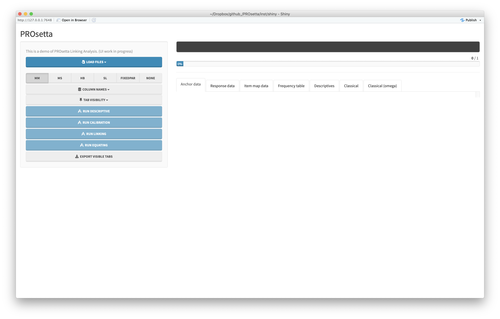
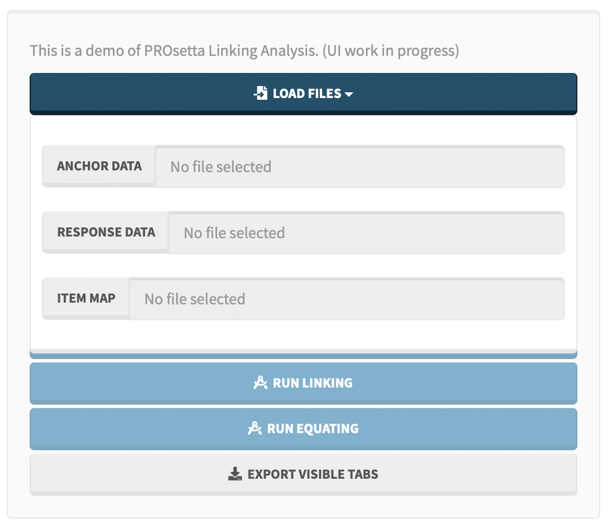
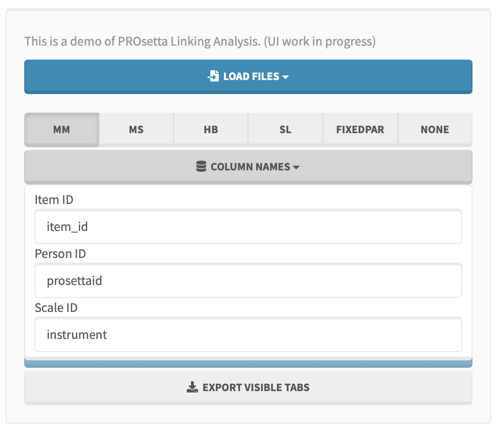
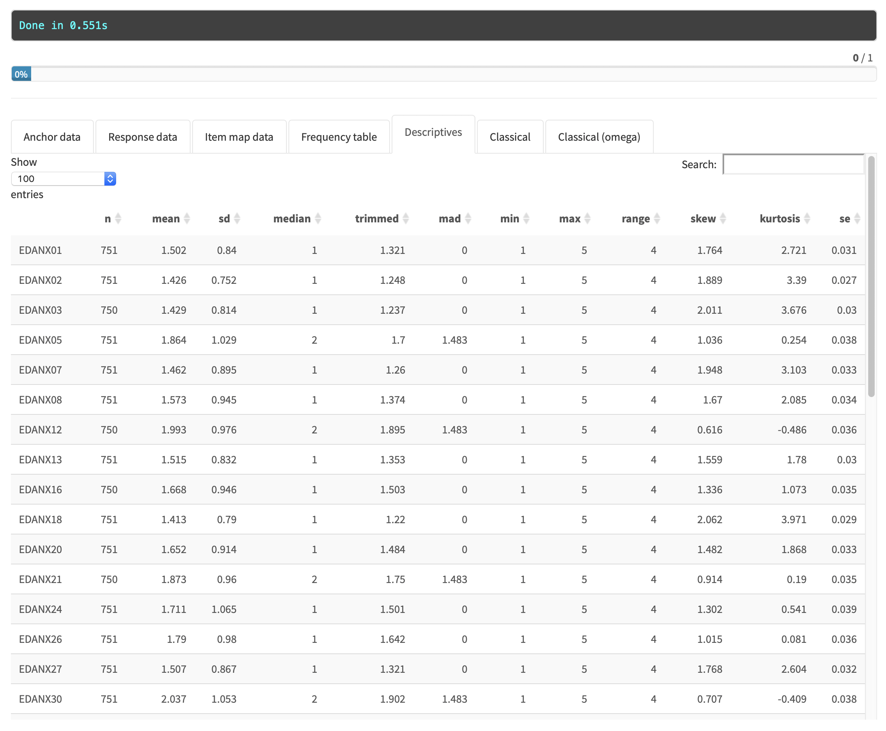
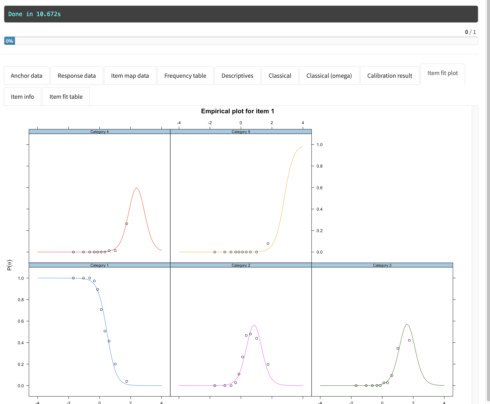
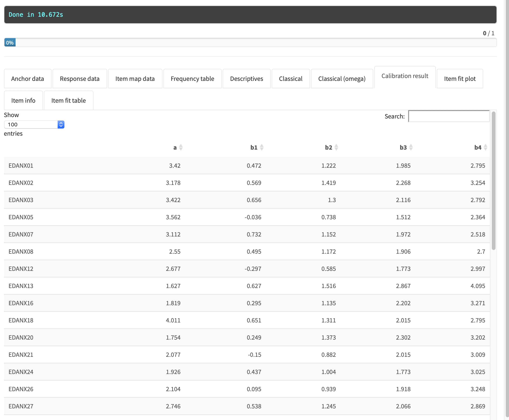
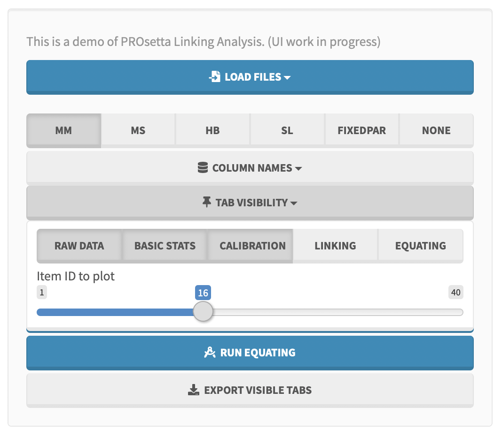
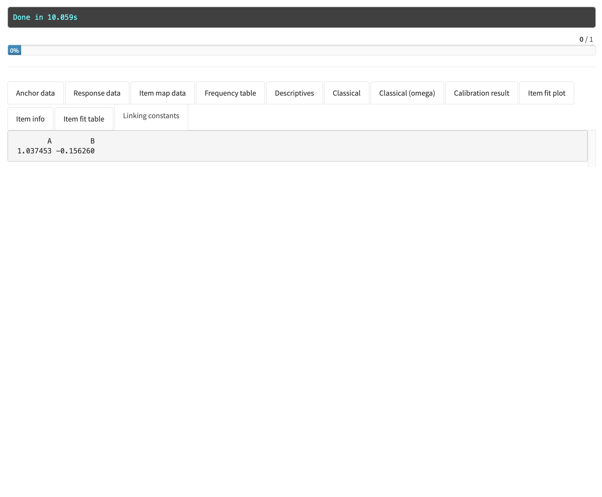
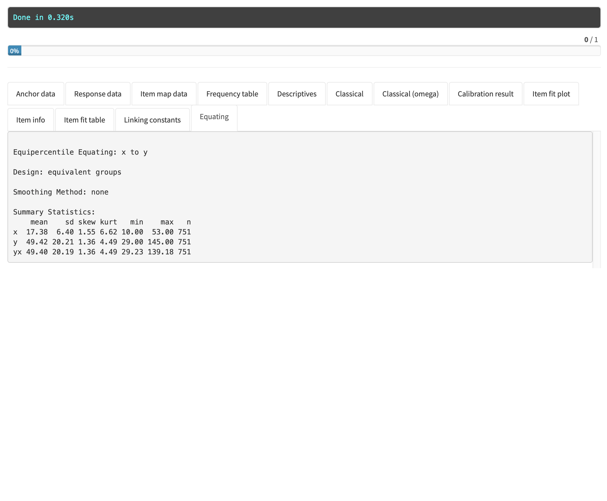

```{r setup, include=FALSE}
require(PROsetta)
```

## Introduction

PROsetta package includes a Shiny application. Run the following to code to launch the application locally on your machine.

```{r, eval = F}
library(PROsetta)
guiPROsetta()
```

The Shiny application looks like below. Shiny application has two panels: the **side panel** (left) and the **main panel** (right).
We will go over on how to use the two panels to run analyses with PROsetta package.

```{r echo=FALSE, out.width = '100%'}

```

## Importing data

The first step is to import datasets. On the side panel (left), click on the "Load Files" button to open a dropdown menu for importing data files.

```{r echo=FALSE, out.width = '75%', fig.align = 'center'}

```

Click on each button to import the datasets. `.csv` files are supported.

1. Click **Anchor Data** to import the file containing item parameters for the anchor items. In each of the steps, the main panel (right) will display the imported content.

2. Click **Response Data** to import the file containing raw item responses.

3. Click **Item Map** to import the file containing item map. The item map maps all item names in the response dataset to a set of new item names you want to use, along with item-level informations such as which instrument each item belongs to, and the number of response levels each item has.

Refer to the example datasets for the required formats of each file.

### Specifying column names

If the imports were successful, the buttons the side panel will be enabled. The column names for the item, scale, person indices have to be specified to run the analyses.
Click **Column Names** to open a dropdown menu.

```{r echo=FALSE, out.width = '75%', fig.align = 'center'}

```

## Running Analyses

### Descriptive statistics

Click the **Run Descriptive** button to get descriptive statistics. This will add (or replace the existing ones) and populate 4 tabs in the main panel.

* Frequency table
* Descriptives
* Classical
* Classical (omega)

The descriptives table would look like this:
```{r echo=FALSE, out.width = '100%'}

```

### Calibration

Click the **Run Calibration** button to perform calibration. The computation may take a while to complete. This will populate 4 tabs in the main panel.

* Calibration result
* Item fit plot
* Item info
* Item fit table

The item fit plot would look something like this:

```{r echo=FALSE, out.width = '100%'}

```

and the parameters.

```{r echo=FALSE, out.width = '100%'}

```

To display the plots for another item, click on the **Tab Visibility** button to open a dropdown menu like this:

```{r echo=FALSE, out.width = '75%', fig.align = 'center'}

```

The slider can be used to display item fit plot and item info plots for a different item.

### Linking

Click the **Run Linking** button to perform scale linking. This will populate *Linking constants* tab with the constants.

```{r echo=FALSE, out.width = '100%'}

```

### Equating

Click the **Run Equating** button to perform equipercentile equating. This will populate *Equating* tab with a summary of the results.

```{r echo=FALSE, out.width = '100%'}

```

## Controlling tab visibility

Performing the four analysis would populate a number of tabs on the main panel. Click on the **Tab Visibility** button to open a dropdown menu like this:

```{r echo=FALSE, out.width = '75%', fig.align = 'center'}

```

Each button can be toggled to change the visibility of the tabs. The buttons correspond to the displaying of imported data and the respective analyses.

